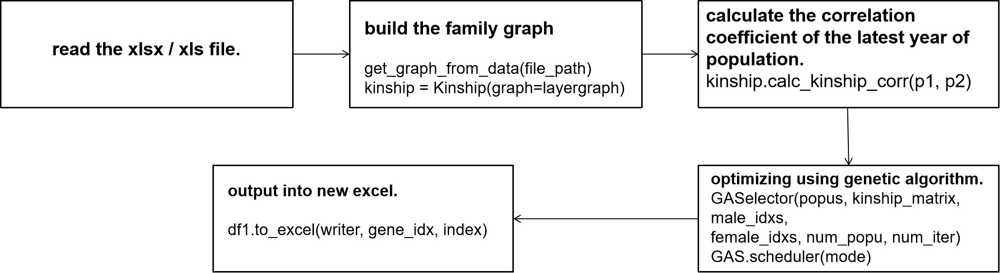

A library of simulation calculation tools for quantitative genetics developed for poultry breeding.

# Optimization of Poultry Matcher
Given information on multiple generations of poultry, such as 2017, 2018 Construct a family graph for the breeding and hatching plan of poultry in 2020, and create the corresponding graph data structure. Then, using genetic algorithm, a breeding plan for poultry in 2021 is proposed, with the goal of minimizing the average phylogenetic correlation coefficient of breeding.


### The Input Data

Table data like xlsx/xls:
- Contains multiple sheets, each named as a year (2017, 2018,...)
- Each sheet has 6 required columns: (male_id, female_id, / wing_id, father_id, mother_id, gender)
- In each sheet, the union of male_id and female_id is a subset of the wing_id set from the previous sheet (previous year). It means that every year's parents are the children of the previous generation.
- In each sheet, the union of the father_id and mother_id is the same as the union of the male_id and female_id in the agreed sheet. It means the offspring born to parents in this year.

### Customize the dataset to construct a family graph and use genetic algorithm to provide a breeding plan
> python3 myself.py

```text
./myself.py
run_main_with_graph(file_path="./datasets/xxx.xlsx",
    result_file="./temp_files/xxx.xlsx",
    configs={"gene_idx": "2024", "mode": "min"})

./inbreeding_lib/BreedingMainESR.py
run_main_with_graph():
    get_graph_from_data(file_path=file_path)  # build the family tree
```
- file_path:  XLSX/XLS files, where each sheet represents the content of a year,
- result_file: The xlsx file that outputs the results,
- configs:
  - Gene_idx: Target year for breeding.
  - mode:  [min, max]， Optimize the objective and minimize/maximize the kinship correlation coefficient.

### calculate Correlation Coefficient Matrix
```text
1. >>
./BreedingMainESR.py
kinship_matrix = np.zeros((male_num, female_num))
for i in range(male_num):
    for j in range(female_num):
        kinship_matrix[i, j] = kinship.calc_kinship_corr(
            p1=popus[male_indices[i]].name,
            p2=popus[female_indices[j]].name)
print(kinship_matrix)

2. >>
./procedure/kinship_on_graph.py
Kinship.analyzer.calc_kinship_corr(self, p1: str, p2: str):
    calc_kinship_corr(ind1,ind2, final=0)  #
    
3. >>
./analyzer/commonAncestor.py 
FamilyAnalyzer.calc_kinship_corr(self, ind1, ind2, final):
    pass
```
FamilyAnalyzer.calc_kinship_corr(self, ind1, ind2, final):
- \> find the common ancestors.
- \> union, and calculate the length of the path.
- \> calculate the coefficient using DFS and recurrent.

### Genetic Algorithm
```text
GAS = GASelector(popus=popus, 
  kinship_matrix=kinship_matrix, male_idxs=male_indices,
  female_idxs=female_indices, num_popu=300, num_iter=50)
best_solution = GAS.scheduler(mode=configs["mode"])
```
- kinship_matrix: the correlation coef matrix of the poultry of latest year for GA.
- popus: the vertices set of the poultry of latest year.

# File System Structure
```text
root(SelectBreeding)
└─myself.py  // Main Program 
└───analyzer  // calculate relationship coefficient libs
└─────LayerGraph.py  // The Family Graph
└─────commonAncestors.py  // calculate on Graph
└───procedure  // Read xlsx File libs
└─────xlsxreader.py  // used to read data from xlsx(Excel) files
└───selector  // Genetic Algorithm libs,
└─────GASelector.py  // Genetic Algorithm Processing
└─────entities.py  // Vertex, Edge, Solution
```

### Key Issue
The core of the entire algorithm consists of two parts, how to calculate the kinship correlation coefficient, and how to assign female individuals to male poultry. 
In fact, our algorithm should be expressed in another way, how to select male individuals for female poultry. 
Because there is a one-to-many relationship between males and females, it is actually critical which one is dominant in the algorithm.


### File Structure
```text
root(Sound-Representation-KZ)
└─Breeding_Main.py  // Main Program, Genetic Algorithm
└─entities.py  // Poultry object and functions
└─breedingkits.py  // functions for breeding
└─xlsxreader.py  // used to read data from xlsx(Excel) files
└─func.py  // generate common value
└─kinship_calc.py  // test the calculation of kinship and inbreed
```


